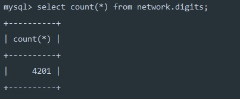

## Задание
---

<br/>

1. Настраиваем асинхронную репликацию.
* Выбираем 2 любых запроса на чтения (в идеале самых частых и тяжелых по логике работы сайта) и переносим их на чтение со слейва.
* Делаем нагрузочный тест по странице, которую перевели на слейв до и после репликации. Замеряем нагрузку мастера (CPU, la, disc usage, memory usage).
* ОПЦИОНАЛЬНО: в качестве конфига, который хранит IP реплики сделать массив для легкого добавления реплики. Это не самый правильный способ балансирования нагрузки. Поэтому опционально.
2. Полусинхронная репликация
* Настроить 2 слейва и 1 мастер.
* Включить row-based репликацию.
* Включить GTID.
* Настроить полусинхронную репликацию.
* Создать нагрузку на запись в любую тестовую таблицу. На стороне, которой нагружаем считать, сколько строк мы успешно записали.
* С помощью kill -9 убиваем мастер MySQL.
* Заканчиваем нагрузку на запись.
* Выбираем самый свежий слейв. Промоутим его до мастера. Переключаем на него второй слейв.
* Проверяем, есть ли потери транзакций.

Требования: В отчете корректно описано, как настроена репликация. 2 запроса переведено на чтение со слейва. Нагрузочное тестирование показало, что нагрузка перешла на слейв. В отчете описано как включить row-based репликацию и GTID Проведен эксперимент по потере и непотере транзакций при аварийной остановке master.

<br/>

## Результат
---

<br/>

### Часть 1 (Асинхронная репликация)

<br/>

Настраиваем асинхронную репликацию:

1. Разворачиваем 2 контейнера в докере с лимитами по производительности для проверки нагрузки.
``` docker
    docker-compose -f scripts/mysql-async-replication.yaml up
```
2. Проверяем, что mysql запущен
  ```bash
  > mysql -u root -p
  ```
3. Задаем server id на мастере и слейве.
  ```mysql
  mysql> SET GLOBAL server_id = 1;
  mysql> SET GLOBAL server_id = 2;
  ```
4. Создаем юзера для репликации на мастере.
  ```mysql
  mysql> create user 'repl' identified by '123';
  mysql> grant replication slave on *.* to repl; 
  ```
5. Задаем мастера для слейва
  ```mysql
  mysql> CHANGE MASTER TO
        MASTER_HOST='mysql_master',
        MASTER_USER='repl',
        MASTER_PASSWORD='123',
        MASTER_LOG_FILE='binlog.000002',
        MASTER_LOG_POS=1355;
  ```
6. Перезагружаем слейва
  ```mysql
  mysql> stop slave;
  mysql> start slave;
  ```
7. Фиксим ошибку авторизации (в проде нужно настраивать сертификаты, для тестов можно отключить):
  ```mysql 
  mysql> alter user 'repl' IDENTIFIED WITH mysql_native_password BY '123';
  ```

<br/>

Нагрузочное тестирование проводилось с помощью jMeter. Нагрузка создавалась на самый тяжелый запрос: поиск пользователей.

Результаты с одной мастер-базой:
* Без нагрузки:
  

* Нагрузка только на мастер:
  

Результаты после подключения реплики:
* Нагрузка поделилась между двумя базами  
  

<br/>
<br/>

### Часть 2 (Полусинхронная gtid репликация)

<br/>

Настраиваем полусинхронную репликацию:

1. Настраиваем [конфиг](/../scripts/config/mysql_gtid.cnf) gtid репликации для всех инстансов MySQL.
2. Разворачиваем 3 контейнера в докере (1 мастер и 2 слейва).
``` docker
    docker-compose -f scripts/mysql-gtid-replication.yml up
```
3. Задаем server id на мастере и слейвах.
  ```mysql
  mysql> SET GLOBAL server_id = 1; -- master
  mysql> SET GLOBAL server_id = 2; -- slave 1
  mysql> SET GLOBAL server_id = 3; -- slave 2
  ```
4. Создаем юзера для репликации на мастере.
  ```mysql
  mysql> create user 'repl' identified by '123';
  mysql> grant replication slave on *.* to repl; 
  ```

6. Задаем мастера для слейвов
  ```mysql
  mysql> CHANGE MASTER TO
        MASTER_HOST='mysql_master',
        MASTER_USER='repl',
        MASTER_PASSWORD='123',
        MASTER_AUTO_POSITION = 1;
  ```
7Перезагружаем слейвы
  ```mysql
  mysql> stop slave;
  mysql> start slave;
  ```

<br/>

Эксеримент по непотере транзакций проводился следующим образом:
1. Была создана тестовая gtid и таблица digits.
2. Был добавлен роут run для запуска транзакций
3. Данное приложение считает количество успешно закоммиченных транзакций, и выводит в конце работы.
4. В момент работы программы был убит мастер: `docker kill mysql_master`;
5. Резутат работы программы следующий: 4602 успешных коммита из 10000.  
   

6. Сразу после этого выполнены запросы на обеих репликах. Количество записей в таблице также составило 734  
   

7. После реанимации мастера оставщиеся транзакции попали на слейвы:
   

Результат эксперимента: все транзакции, попавшие на мастер, были исполнены на слейвах после восстановления соединения.
